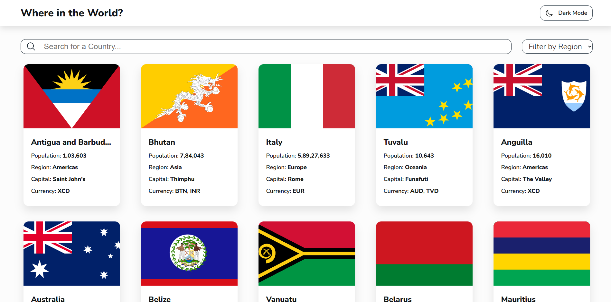
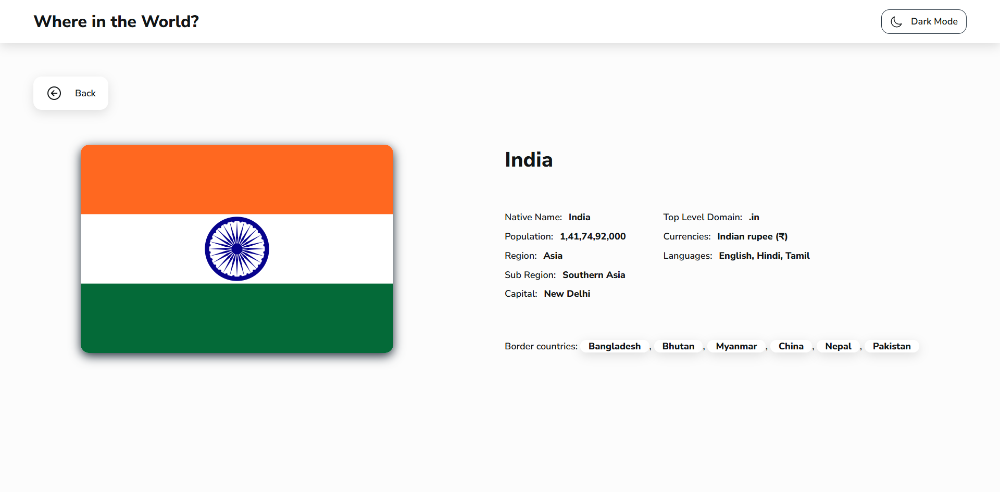

# 🌍 REST Countries Explorer

A frontend application built using the **REST Countries API** that allows users to explore countries around the world with *search*, *region filtering*, *detailed views*, and a *persistent light/dark theme*.  
The project emphasizes **performance, caching, and clean UI interactions** using **vanilla JavaScript**.

----------

## ✨ Features

-   🌐 Fetch and display all countries from the REST Countries API
    
-   🔍 Search countries by name in real time
    
-   🌎 Filter countries by region
    
-   📄 View detailed information on a separate country page
    
-   🧭 Navigate between border countries
    
-   🌓 Light/Dark mode with persistent preference
    
-   ⚡ Client-side caching for faster reloads
    
-   🦴 Skeleton loaders for improved UX during data fetch
    

----------

## 🛠️ Built With

-   HTML
    
-   CSS
    
-   JavaScript
    
-   REST Countries API
    
-   `localStorage` 
    

----------

## 🚀 Performance Optimizations

-   **API response caching** using `localStorage` with expiration
    
-   **Reduced network calls** on reload
    
-   **Skeleton loading UI** for better perceived performance
    

----------

## 🧠 What I Learned

-   Implementing **client-side caching** without frameworks
    
-   Handling **UI state** (search, filter, theme) efficiently
    
-   Understanding the difference between  **JS-level caching** vs **HTTP caching** 
    
-   Writing cleaner, more maintainable vanilla JavaScript
    

----------

## 📸 Screenshots

----------

## 🔗 Links

-   **Live Demo:** [https://your-live-site-url.com](https://your-live-site-url.com)
    
-   **Frontend Mentor Solution:** https://www.frontendmentor.io/solutions/your-solution-id
    

----------

## 🔮 Future Improvements

-   Service Worker caching for offline support
    
-   Accessibility improvements (ARIA, keyboard navigation)
    
-   Code splitting and modularization
    
-   Animations for page transitions
    

----------

## 👤 Author

**Akash**

-   GitHub: https://github.com/therealakash13
    
-   Frontend Mentor: https://www.frontendmentor.io/profile/therealakash13
    

----------

## 🙌 Acknowledgments

-   [Frontend Mentor](https://www.frontendmentor.io/) for the challenge
    
-   [REST Countries API](https://restcountries.com/) for the data